# medstats

English | [简体中文](README.zh-CN.md)

**medstats** is an R package that streamlines common workflows in
medical and epidemiological research. It provides tools for clinical data
processing, statistical modeling, publication-ready tables, and
high-quality visualization.

## Highlights

- Create baseline characteristic tables and publication-ready three-line tables.
- Convert longitudinal clinical records into survival-analysis datasets.
- Fit generalized linear models, Cox models, and GEE repeated-measures models.
- Produce Kaplan–Meier curves, forest plots, restricted cubic spline plots,
  ROC curves, Sankey diagrams, and longitudinal summary plots.
- Export formatted tables and R plots to a single Word document.

## Installation

Install the development version from GitHub:

```r
install.packages("remotes")

remotes::install_github(
  "shanjiayu1/medstats",
  dependencies = TRUE
)

library(medstats)
```

Using `dependencies = TRUE` also installs packages needed by optional examples,
tests, and vignettes.

## Function reference

| Category        | Function                      | Description                                                                                              |
| --------------- | ----------------------------- | -------------------------------------------------------------------------------------------------------- |
| Tables          | `format_flextable()`        | Apply a publication-ready three-line table style to a data frame,`gtsummary`, or `flextable` object. |
| Tables          | `export_word()`             | Export formatted tables and plots to one Word document.                                                  |
| Data processing | `long_to_surv_data()`       | Convert longitudinal records into one-row-per-subject survival data.                                     |
| Data processing | `merge_duplicate_records()` | Merge duplicate records using the first non-missing value in each field.                                 |
| Data processing | `make_table1()`             | Create a baseline characteristics table with optional group comparisons.                                 |
| Modeling        | `longdata_analysis()`       | Analyze repeated measurements using descriptive statistics, group comparisons, and GEE models.           |
| Modeling        | `run_glm_auto()`            | Run automated univariable and multivariable generalized linear models.                                   |
| Modeling        | `run_cox_auto()`            | Run automated univariable and multivariable Cox regression.                                              |
| Visualization   | `plot_meanse()`             | Plot group-specific means with standard errors over time.                                                |
| Visualization   | `plot_stacked()`            | Plot category percentages as stacked bars over time.                                                     |
| Visualization   | `plot_km()`                 | Draw Kaplan–Meier cumulative event curves with an optional risk table.                                  |
| Visualization   | `plot_sankey()`             | Visualize transitions between states across time points.                                                 |
| Visualization   | `plot_forest()`             | Create a forest plot from formatted estimate and confidence-interval text.                               |
| Visualization   | `plot_rcs()`                | Evaluate and visualize nonlinear associations using restricted cubic splines.                            |
| Visualization   | `plot_roc()`                | Evaluate discrimination using a ROC curve, AUC, and optimal cutoff.                                      |

## Table formatting

### Format a table

```r
# Format a data frame
ft_data <- format_flextable(
  head(mtcars[, 1:5])
)

# Format a gtsummary object
tbl <- gtsummary::tbl_summary(
  data = gtsummary::trial,
  include = c(age, marker, grade),
  by = trt
)

ft_summary <- format_flextable(tbl)
```

### Export tables and plots to Word

```r
# Detailed approach: specify data and titles separately with full customization
table1=head(mtcars)

p1 <- ggplot2::ggplot(mtcars, ggplot2::aes(wt, mpg)) +
  ggplot2::geom_point()

export_word(
  data_list = list(
    table1,
    p1
  ),
  table_titles = c(
    "Table 1. mtcars dataset",
    "Figure 1. MPG and weight"
  ),
  output_file = "tables_and_plots.docx",
  figure_width = 6,
  figure_height = 5
)
# Simplified approach: pass objects directly (titles auto-generated from object names)
export_word(table1, p1, "tables_and_plots.docx")
```
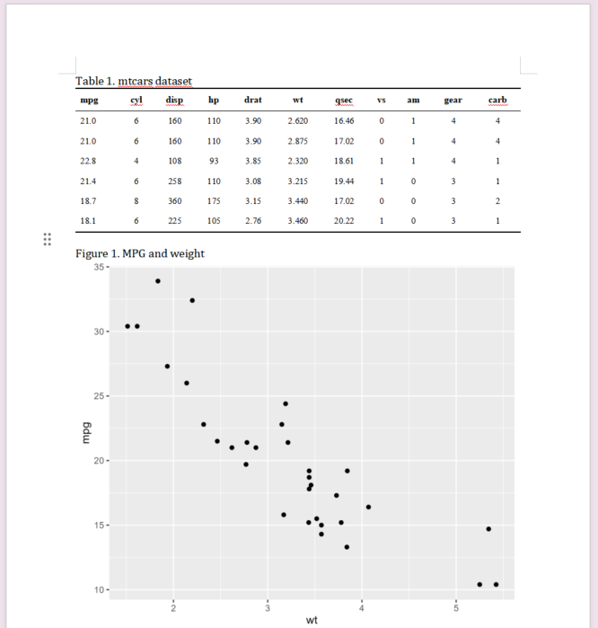
When objects are passed directly or `table_titles` is omitted, titles are
generated automatically (`Table 1`, `Table 2`, `Figure 1`, ...). Table titles
appear above tables; figure titles appear below figures.

Plots and existing PNG files can be mixed with tables. Plots are rendered on a
9 by 7 inch canvas by default and then scaled to the usable Word page width.
For PNG files, omit `word_height` to preserve the original aspect ratio:

```r
p1 <- ggplot2::ggplot(mtcars, ggplot2::aes(wt, mpg)) +
  ggplot2::geom_point()
ggplot2::ggsave(
  filename = "p1.png",
  plot = p1,
  width = 7,
  height = 7,
  dpi = 300
)
export_word(
  data_list = list(p1, "p1.png"),
  table_titles = c("Figure 1", "Figure 1"),
  output_file = "results.docx",
  word_width = 6.2
)
```

The function also accepts result objects returned by package functions such as
`plot_meanse()` and `plot_roc()` (their `$plot` element is used automatically),
image file paths, and base R plots wrapped in `officer::plot_instr()`.

## Data processing

### Convert longitudinal data to survival format

```r
clinical_data <- datasets::ChickWeight |>
  dplyr::mutate(
    reached_150g = as.integer(weight >= 150)
  )

surv_data <- long_to_surv_data(
  data = clinical_data,
  id_var = "Chick",
  event_flag_var = "reached_150g",
  time_var = "Time",
  baseline_vars = "Diet"
)
```

### Merge duplicate records

```r
clinical_records <- data.frame(
  patient_id = c("P001", "P001", "P002", "P002"),
  age = c(NA, 65, 52, 53),
  diagnosis = c("Hypertension", NA, NA, "Diabetes")
)

clean_records <- merge_duplicate_records(
  data = clinical_records,
  group_vars = "patient_id"
)

clean_records
```

When conflicting non-missing values occur in a duplicate group, the function
retains the first value in the current row order. Sort the data beforehand if
another priority is required.

### Create a baseline characteristics table

```r
table1 <- make_table1(
  data = gtsummary::trial,
  vars = c("age", "marker", "stage", "grade"),
  specific_vars = "marker",  # Report as median (P25, P75)
  group_var = "trt"
)

table1
```


## Statistical modeling

### Repeated-measures analysis with GEE

`longdata_analysis()` summarizes the outcome at each time point, compares
groups cross-sectionally, evaluates within-group trends, and tests the
time-by-group interaction using GEE.

```r
data("Orthodont", package = "nlme")

orthodont_data <- Orthodont |>
  as.data.frame() |>
  dplyr::mutate(
    time_str = paste0(age, " years")
  )

gee_results <- longdata_analysis(
  data = orthodont_data,
  id_col = "Subject",
  treatment_col = "Sex",
  time_col = "time_str",
  score_col = "distance"
)

print(gee_results)
format_flextable(gee_results)
```

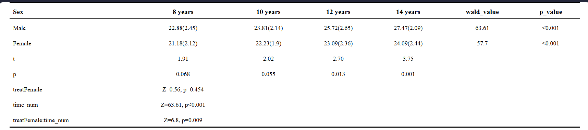

The input must be in long format, with one row per subject and measurement
time. The time variable must contain an extractable numeric component.

### Automated generalized linear models

Linear regression:

```r
linear_results <- run_glm_auto(
  data = mtcars,
  vars = c("hp", "wt"),
  outcome_var = "mpg",
  family = "gaussian"
)
```

Logistic regression:

```r
logistic_results <- run_glm_auto(
  data = gtsummary::trial,
  vars = c("age", "stage"),
  outcome_var = "response",
  family = "binomial"
)

format_flextable(logistic_results)
```

Formatted regression tables use superscript model markers in the headers and
English footnotes below the table: `1 Univariable analysis.` and
`2 Multivariable analysis.`

### Automated Cox regression

```r
lung_data <- survival::lung
lung_data$status_event <- as.integer(lung_data$status == 2)
lung_data$sex <- factor(
  lung_data$sex,
  levels = c(1, 2),
  labels = c("Male", "Female")
)

cox_results <- run_cox_auto(
  data = lung_data,
  vars = c("age", "sex"),
  time_var = "time",
  event_var = "status_event"
)
format_flextable(cox_results)
```

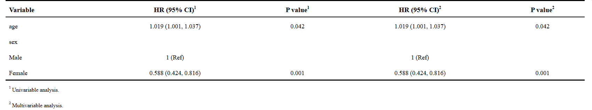

## Data visualization

### Mean ± standard error line plot

```r
growth_data <- datasets::ChickWeight |>
  dplyr::filter(Time %in% c(0, 4, 10, 14, 21)) |>
  dplyr::mutate(
    time_label = paste0("Day ", Time),
    diet_label = paste0("Diet ", Diet)
  )

meanse_result <- plot_meanse(
  data = growth_data,
  target_var = "weight",
  time_var = "time_label",
  group_var = "diet_label",
  xlab = "Growth time (days)",
  ylab = "Mean weight (g)",
  legend_title = "Diet"
)
#保存图片
ggsave(meanse_result$plot, file = "meanse_plot.png", width = 6, height = 5)

```
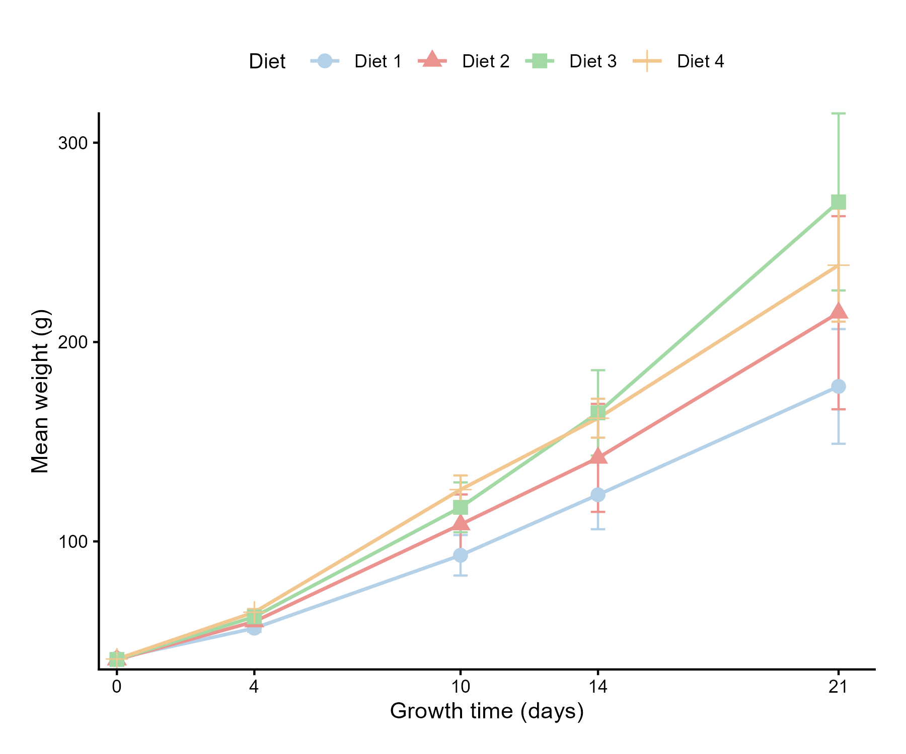
For two-group data, set `test_method = "t"` or `test_method = "wilcox"` to
compare the groups at every time point. Significant results are marked above
the corresponding time point, and the p-values are returned in `test_data`.

```r
two_diet_result <- plot_meanse(
  data = dplyr::filter(growth_data, diet_label %in% c("Diet 1", "Diet 2")),
  target_var = "weight",
  time_var = "time_label",
  group_var = "diet_label",
  test_method = "wilcox",
  legend_title = "Diet"
)

two_diet_result$test_data
```

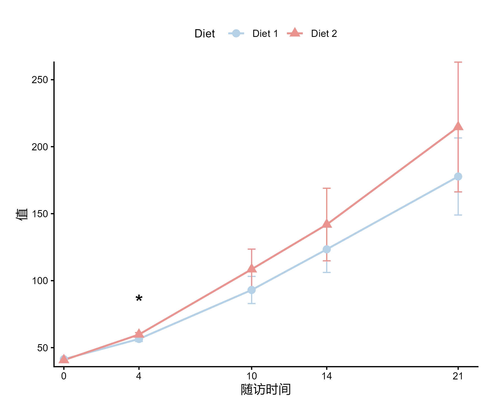

### Stacked percentage bar plot

```r
stacked_data <- datasets::ChickWeight
stacked_data$Time <- factor(
  stacked_data$Time,
  levels = sort(unique(stacked_data$Time))
)

stacked_result <- plot_stacked(
  data = stacked_data,
  target_var = "weight",
  time_var = "Time",
  group_var = "Diet",
  breaks = c(-Inf, 100, 200, 300, Inf),
  labels = c("≤100 g", "101–200 g", "201–300 g", ">300 g"),
  colors = c("#B5D1E8", "#A3D9A5", "#F2C68F", "#EB938F"),
  legend_title = "Weight range",
  label_size = 4.5
)
```

Set `group_var = NULL` (the default) to draw one stacked bar per time point.
When a grouping column is supplied, percentages are calculated within each
time-by-group combination and the group stacks are drawn side by side.
Use `label_size` to adjust the percentage-label font size inside the bars.

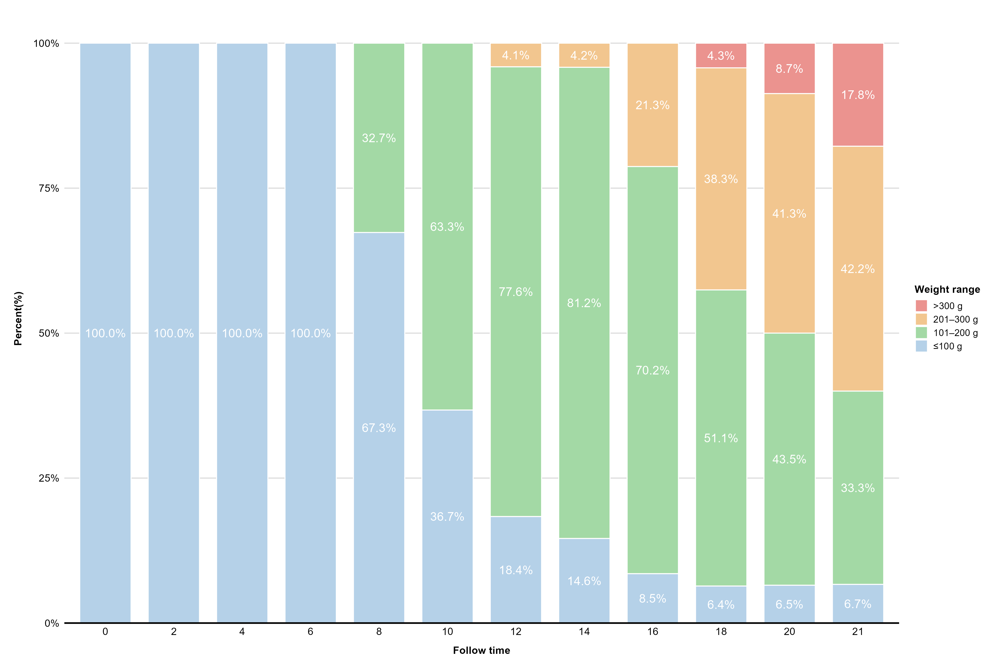

### Kaplan–Meier cumulative event curve

```r
lung_data <- survival::lung
lung_data$status_event <- as.integer(lung_data$status == 2)
lung_data$sex <- factor(
  lung_data$sex,
  levels = c(1, 2),
  labels = c("Male", "Female")
)

plot_km(
  data = lung_data,
  group_var = "sex",
  time_var = "time",
  status_var = "status_event",
  legend_labs = c("Male", "Female"),
  legend_title = "Sex",
  xlab = "Follow-up time (days)",
  ylab = "Cumulative mortality (%)",
  xlim = c(0, 1000),
  break_time = 200,
  show_risk_table = TRUE,
  save_filename = "Lung_KM.png"
)
```

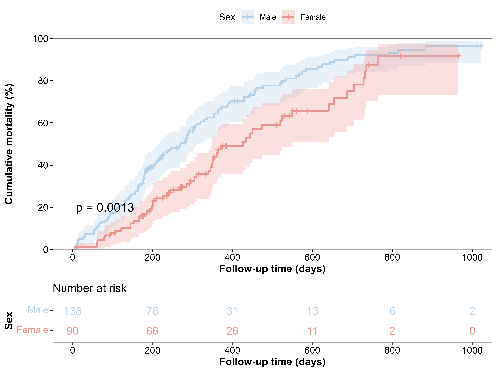

### Sankey plot

```r
sankey_data <- datasets::ChickWeight |>
  dplyr::filter(Time %in% c(0, 10, 20)) |>
  dplyr::mutate(
    visit = factor(
      paste0("Day ", Time),
      levels = c("Day 0", "Day 10", "Day 20")
    ),
    weight_status = dplyr::case_when(
      weight < 50 ~ "Light",
      weight < 150 ~ "Normal",
      TRUE ~ "Heavy"
    ),
    weight_status = factor(
      weight_status,
      levels = c("Light", "Normal", "Heavy")
    )
  )

sankey_plot <- plot_sankey(
  data = sankey_data,
  id_var = "Chick",
  time_var = "visit",
  state_var = "weight_status",
  na_strategy = "show",
  missing_label = "Drop-out"
)

sankey_plot
```

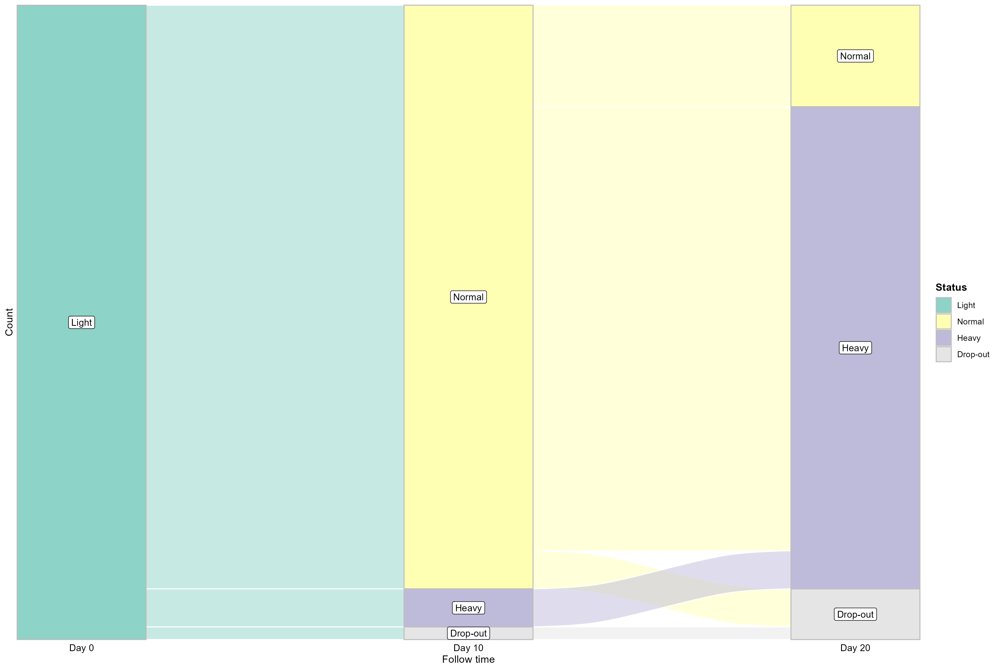

### Forest plot

```r
forest_data <- data.frame(
  Variable = c("Age", "Stage II", "Stage III"),
  `OR (95% CI)` = c(
    "1.02 (0.99, 1.05)",
    "1.45 (0.82, 2.56)",
    "2.10 (1.12, 3.94)"
  ),
  `P value` = c("0.180", "0.200", "0.021"),
  check.names = FALSE
)

plot_forest(
  data = forest_data,
  ci_column = "OR (95% CI)",
  x_ticks = c(0, 0.5, 1, 2, 4),
  output_name = "Forest_plot.png"
)
```

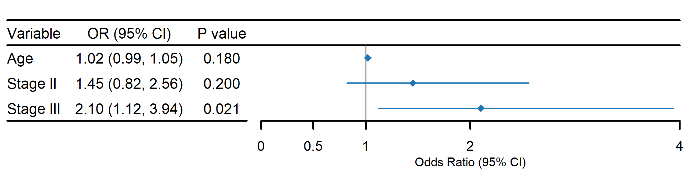

### Restricted cubic spline plot

Linear model:

```r
rcs_linear <- plot_rcs(
  data = mtcars,
  exposure = "wt",
  outcome = "mpg",
  covars = c("hp", "disp"),
  nk = 4,
  model_type = "linear",
  xlab = "Weight",
  ylab = "Predicted MPG"
)

rcs_linear$plot
```

Cox model:

```r
library(survival)
lung_rcs <- survival::lung
lung_rcs$status_event <- as.integer(lung_rcs$status == 2)

rcs_cox <- plot_rcs(
  data = lung_rcs,
  exposure = "age",
  outcome = "Surv(time, status_event)",
  covars = c("sex", "ph.ecog"),
  model_type = "cox",
  ylab = "Hazard ratio"
)

rcs_cox$plot
```

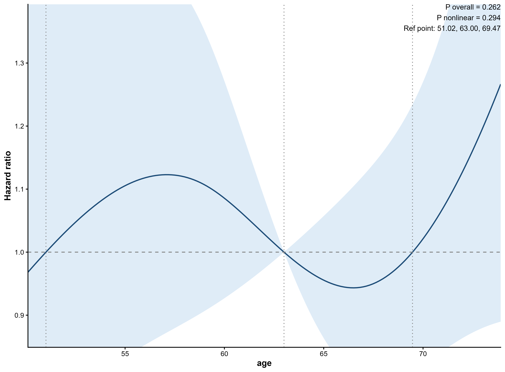

### ROC curve

```r
roc_model <- glm(
  am ~ mpg + hp + wt,
  data = mtcars,
  family = binomial
)

roc_data <- mtcars
roc_data$predicted_probability <- predict(
  roc_model,
  newdata = roc_data,
  type = "response"
)

roc_result <- plot_roc(
  data = roc_data,
  true_var = "am",
  pred_var = "predicted_probability",
  title = "Training ROC curve",
  line_color = "#2E86AB"
)

roc_result$plot
```

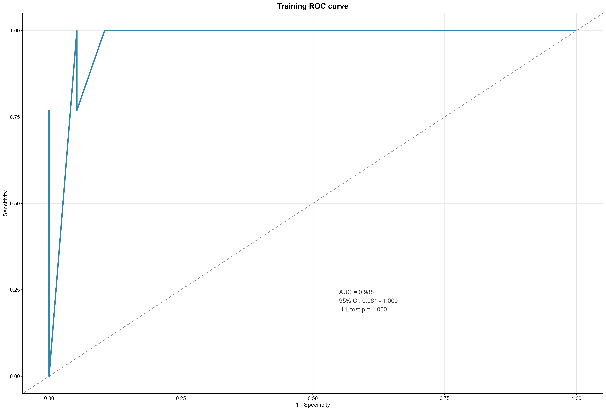
